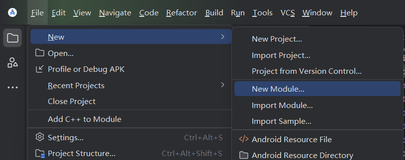
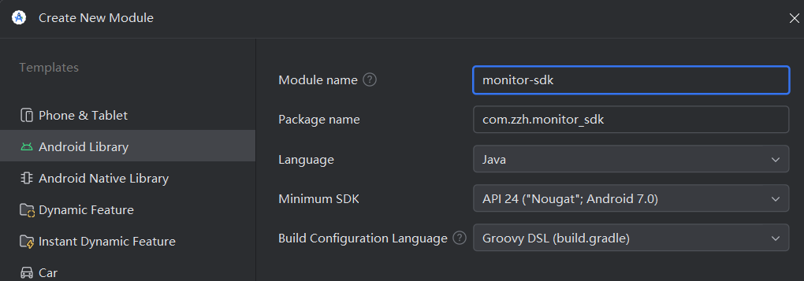

### 作业4：开发一个客户端SDK实现流畅性监控和ANR监控

### 1. 新建SDK模块





### 2. 流畅性检测

重载Choreographer.FrameCallback的doFrame函数，记录每次doFrame函数被调用的时间，用当前时间减去上次调用时间即可得到ui刷新两帧的间隔，再除16.6ms就得到了卡顿帧数。

```kotlin
package com.zzh.monitor_sdk;

import android.util.Log;
import android.view.Choreographer;

public class FluencyMonitor {
    private static final String TAG = "FluencyMonitor";
    private boolean isMonitoring = false;

    private long lastFrameTimeNanos = 0;

    private static final long STANDARD_FRAME_NS = 16_600_000;

    private Choreographer.FrameCallback frameCallback = new Choreographer.FrameCallback() {
        @Override
        public void doFrame(long frameTimeNanos) {
            if (lastFrameTimeNanos == 0) {
                lastFrameTimeNanos = frameTimeNanos;
            } else {
                long diffNanos = frameTimeNanos - lastFrameTimeNanos;
                if (diffNanos > STANDARD_FRAME_NS) {
                    long skippedFrames = diffNanos / STANDARD_FRAME_NS;
                    if (skippedFrames > 5) {
                        Log.w(TAG, "检测到卡顿！上两帧间隔: " + (diffNanos / 1000000) + "ms, 丢帧: " + skippedFrames + " 个");
                    }
                }
                lastFrameTimeNanos = frameTimeNanos;
            }

            if (isMonitoring) {
                Choreographer.getInstance().postFrameCallback(this);
            }
        }
    };

    public void start() {
        isMonitoring = true;
        lastFrameTimeNanos = 0;
        Choreographer.getInstance().postFrameCallback(frameCallback);
        Log.d(TAG, "流畅性监控已启动...");
    }
    public void stop() {
        isMonitoring = false;
        Choreographer.getInstance().removeFrameCallback(frameCallback);
    }
}
```

### 3. 看门狗检测

每3秒通知主线程执行ticker代码块，若未执行则可以根据currentTick == lastTick判断得出，打印日志和当前栈信息。

```kotlin
package com.zzh.monitor_sdk;

import android.os.Handler;
import android.os.Looper;
import android.util.Log;

public class AnrMonitor extends Thread {
    private static final String TAG = "AnrMonitor";
    private static final long ANR_TIMEOUT = 3000;
    private boolean isMonitoring = false;
    private Handler mainHandler = new Handler(Looper.getMainLooper());

    private volatile long lastTick = 0;
    private volatile long currentTick = 0;

    private Runnable ticker = new Runnable() {
        @Override
        public void run() {
            currentTick = (currentTick + 1) % Long.MAX_VALUE;
        }
    };

    @Override
    public void run() {
        while (isMonitoring) {
            lastTick = currentTick;

            mainHandler.post(ticker);

            try {
                Thread.sleep(ANR_TIMEOUT);
            } catch (InterruptedException e) {
                e.printStackTrace();
                return;
            }

            if (currentTick == lastTick) {
                Log.e(TAG, "发生 ANR！主线程已经卡死 " + (ANR_TIMEOUT/1000) + " 秒了！");

                StackTraceElement[] stackTrace = Looper.getMainLooper().getThread().getStackTrace();
                for (StackTraceElement element : stackTrace) {
                    Log.e(TAG, "\tat " + element.toString());
                }
            } else {
                Log.d(TAG, "主线程很健康，看门狗继续巡逻...");
            }
        }
    }

    public void startMonitor() {
        isMonitoring = true;
        this.start();
        Log.d(TAG, "ANR 看门狗已启动...");
    }
}
```

### 4. 合并启动函数

```kotlin
package com.zzh.monitor_sdk;

import android.util.Log;

public class MonitorManager {
    private static final String TAG = "PerformanceManager";
    private static final MonitorManager instance = new MonitorManager();

    private FluencyMonitor fluencyMonitor;
    private AnrMonitor anrMonitor;
    private MonitorManager() {
        fluencyMonitor = new FluencyMonitor();
        anrMonitor = new AnrMonitor();
    }
    public static MonitorManager getInstance() {
        return instance;
    }
    public void startMonitor() {
        fluencyMonitor.start();
        anrMonitor.startMonitor();
        Log.d(TAG, "流畅性、ANR监控启动完成！");
    }
    public void stopMonitor() {
        fluencyMonitor.stop();
        // anrMonitor 目前没有写 stop，实际开发中建议加上
        Log.d(TAG, "性能监控 SDK 已停止。");
    }
}
```

### 5. 在MainActivity中启动两个监控，并写两个按钮模拟掉帧场景和卡死场景

```kotlin
package com.zzh.homework4;

import android.os.Bundle;
import android.util.Log;
import android.widget.Button;

import androidx.appcompat.app.AppCompatActivity;

import com.zzh.monitor_sdk.MonitorManager;

public class MainActivity extends AppCompatActivity {

    @Override
    protected void onCreate(Bundle savedInstanceState) {
        super.onCreate(savedInstanceState);
        setContentView(R.layout.activity_main);

        MonitorManager.getInstance().startMonitor();

        Button btnLag = findViewById(R.id.btn_lag);
        btnLag.setOnClickListener(v -> {
                try {
                    Log.w("Test", "模拟掉帧...");
                    Thread.sleep(800);
                } catch (InterruptedException e) {
                    e.printStackTrace();
                }
            });
        Button btnLag2 = findViewById(R.id.btn_lag2);
        btnLag2.setOnClickListener(v -> {
            try {
                Log.w("Test", "模拟死锁/卡死...");
                Thread.sleep(10000);
            } catch (InterruptedException e) {
                e.printStackTrace();
            }
        });
    }
}
```